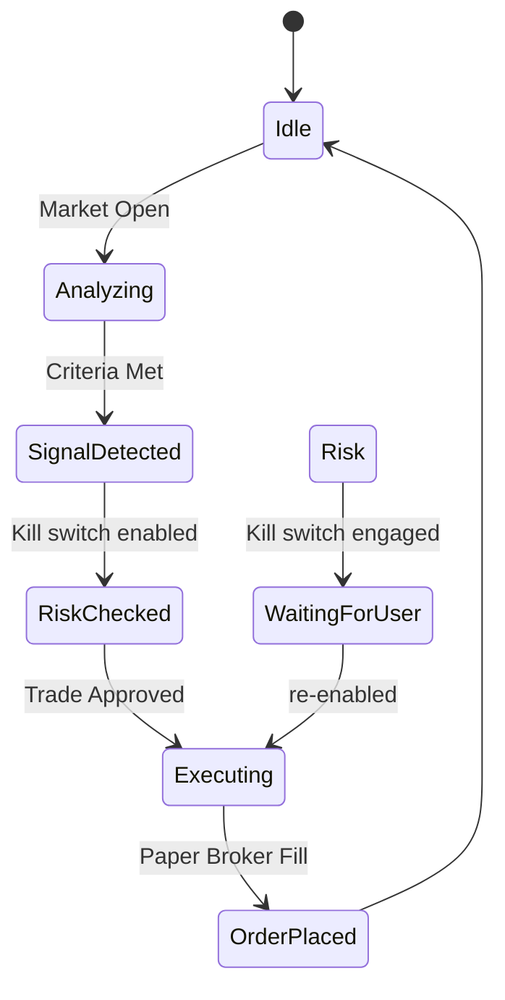

# UI/UX System: FX Analyzer Pro

## Design Principles
- **Futuristic Premium:** High contrast, deep blacks, vibrant neons (Emerald for
  Buy, Ruby for Sell).
- **Dynamic Feedback:** Micro-animations on signal state changes and position
  updates (framer-motion).
- **Efficiency:** A single-view dashboard for critical telemetry plus focused
  sub-views for trading, research, risk, and models.

## Application Shell (Next.js App Router)
- `/` — Landing page (marketing site, `docs/index.html` mirrors it on Pages)
- `/login`, `/register`, `/onboarding` — JWT auth flow (token in localStorage,
  sessions via zustand)
- `/(main)/dashboard` — live ticker, signal grid with confidence scores,
  positions, risk telemetry
- `/(main)/trading` — order panel, paper-broker position management, kill switch
  (`risk_settings.tradingEnabled`)
- `/(main)/analysis` — current market/agent analysis view
- `/(main)/agents` — agent arena: running research/analyst/risk agents
- `/(main)/research` — vibe research reports (backtests + alpha benchmark),
  model playground
- `/(main)/portfolio` — historical log, performance metrics
- `/(main)/settings` — risk settings (max lots, kill switch), model selection,
  theme, broker credentials
- `/signals/[id]` — signal drill-down
- `/admin` — admin surfaces

## Visual Hierarchy
1. **Ticker Bar:** Real-time prices across the top.
2. **Signal Grid:** High-accuracy signals with confidence scores.
3. **Execution Panel:** One-click order placement for active signals.
4. **Historical Log:** Recent trades and performance metrics.

## State Flow

## Data Layer
- Realtime updates via Socket.IO bus (`lib/socketEventBus.js`): ticker, signals,
  positions, risk stats, vibe research, model changes, trade results.
- REST `/api/*` (JWT-guarded, rate-limited): auth, signals, analytics, risk
  settings, models, vibe research, broker status.

## Inspiration
- Inspired by [21st.dev](https://21st.dev) for motion-rich components.
- Glassmorphism alternative: "Deep Neo" — solid dark backgrounds with vibrant
  glowing borders and depth shadows.